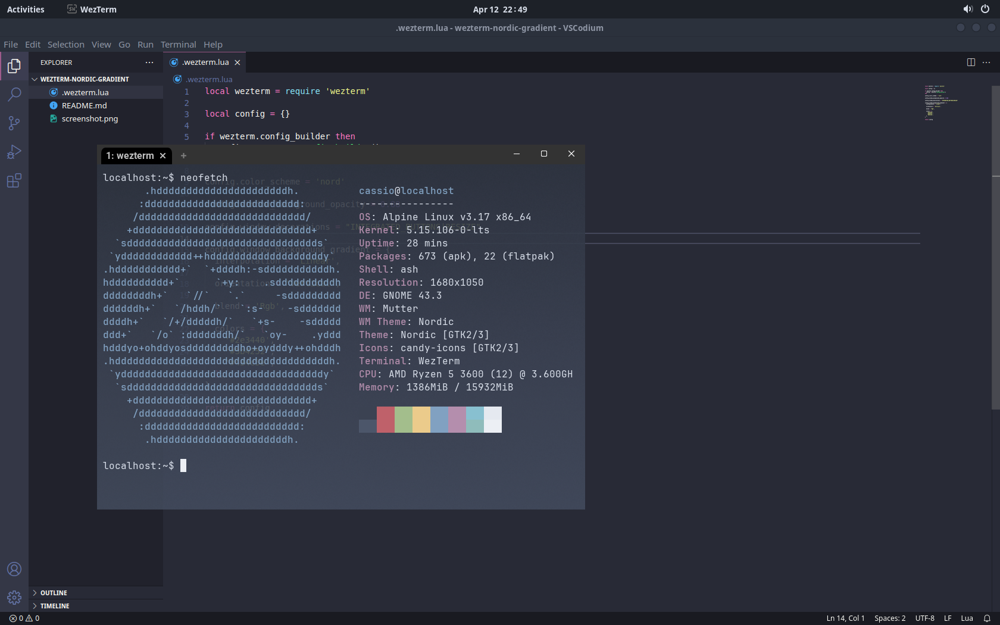

<h1 align="center">
  Wezterm Nordic Gradient
</h1>

<h4 align="center">Nothing fancy, just nordic pallet with a nordic gradient</h4>

  <a href="#about">About</a> •
  <a href="#usage">Usage</a> •
  <a href="#credits">Credits</a> •
  <a href="#license">License</a>

## About

Just a simple config file to setup a nice gradient for [nord pallet](https://wezfurlong.org/wezterm/colorschemes/n/index.html#nord) in WezTerm with background opacity.

## Usage

Just copy put the file [.wezterm.lua](.wezterm.lua) to your home directory.

## Credits

Thanks for the open source projects bellow:

- [wezterm](https://github.com/wez/wezterm)
- [nord](https://github.com/nordtheme/nord)

## License

MIT
